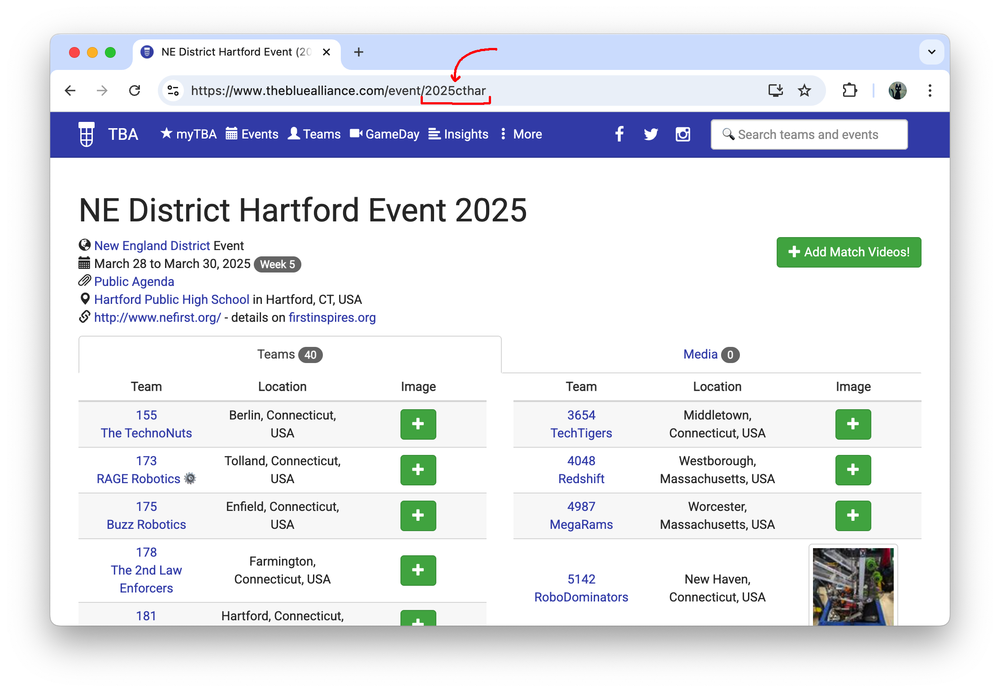
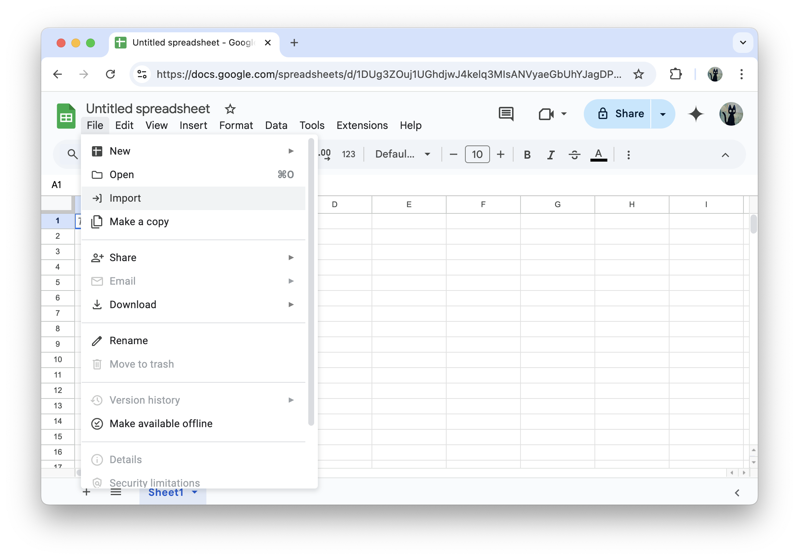
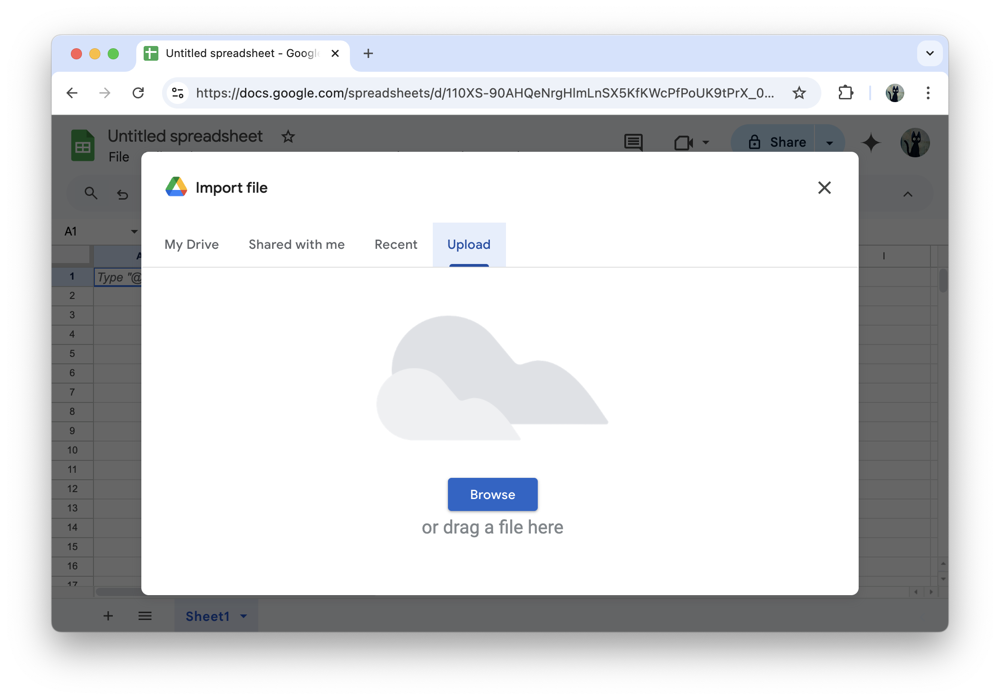
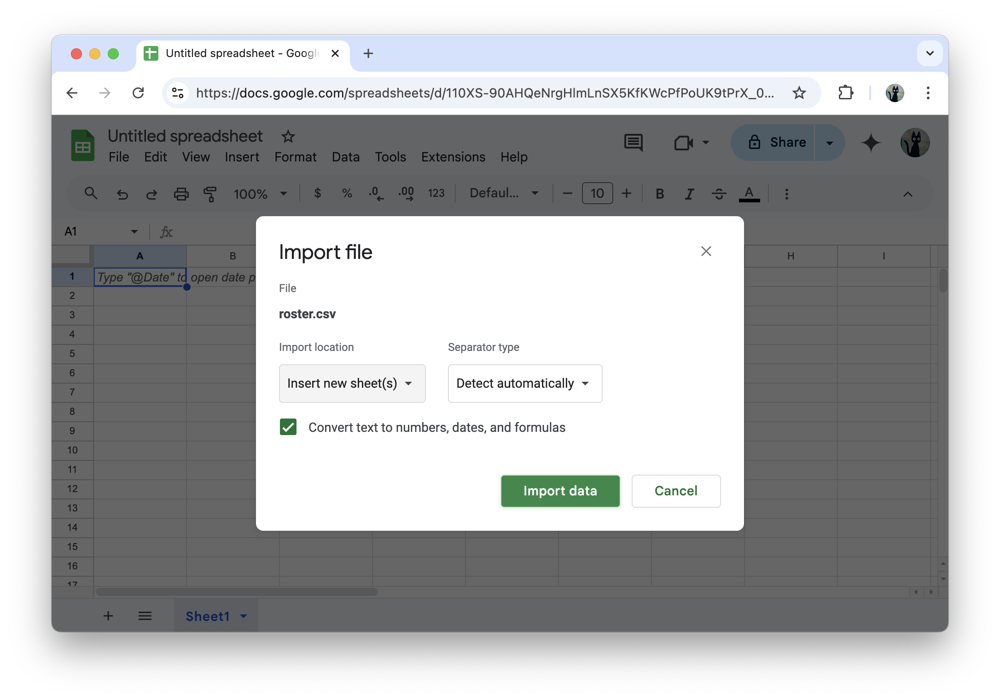

# Scouting Helper Scripts

These are a collection of python scripts to pull data from The Blue Alliance. These are also designed to be self-contained, so they can be used outside of this project.

This project is powered by [The Blue Alliance](https://www.thebluealliance.com/), but is not associated with them in any way.

# Usage
- [Required Software](#setup)
- [Generating a Blue Alliance API Key](#getting-an-api-key)
- [Finding Event Key](#how-to-find-the-event-key)
- [Downloading Event Rosters](#event-roster)
- [Downloading Event Schedules](#event-schedule)
- [Adding Data to a Google Sheet](#adding-data-to-google-sheets)

# Setup

## python3
Go to <https://www.python.org/downloads/> and download the latest python for your operating system.

### Note for Windows

Make sure you select "Add python.exe to PATH" at the start of installation.

At the end of installation, it will ask if you want to disable the
path length limit. Click the option to do this.

## Downloading the scripts
The scripts have no external dependencies, so they can simply be downloaded and used.

To download the scripts repository on windows, open a new Git Bash window, and run `cd ~/Documents/`, then `git clone https://github.com/Team2168/scouting_helperscripts.git`. The scripts will now be located at `Documents\scouting_helperscripts`. Type `cd scouting_helperscripts` to open this folder.

# The Blue Alliance
*The Blue Alliance* is an external website used to collect and query FIRST match data. To query this data, we need to create an [API](https://en.wikipedia.org/wiki/API) token to authenticate requests we make to TBA.

## Getting an API key

To get an API key, you must first create an account with TBA. To do this, go to <https://www.thebluealliance.com/>, and select More > Account in the menu.

Then, create an account by linking a Google or Apple account and providing a username.

Scroll down in the account settings until you reach **Read API Keys**. Enter a description here for your own purposes, and click "Add New Key".
Copy the value under `X-TBA-Auth-Key`, and keep it safe. This value is used to identify your account to the Blue Alliance.

## How to find the event key

On TBA (and in FIRST's internal systems), each event has a unique identifier (or "key"). This is used by the TBA API to select which event to get data for. The easiest way to find this key is to check the URL of the event you want data for.

# Getting Data
## Event Roster

In a terminal opened to the same location you cloned the repository, run `py get_teams.py -e <event_key> -k <api_key> -o roster.csv`, substituting in the event and API keys you got earlier. This will save the event roster to a file `roster.csv` into your current folder.

**Note:** If `py` gave a "command not found" error, try `python3` or `python`.

## Event Schedule

In a terminal opened to the same location you cloned the repository, run `py get_tba_schedule.py -e <event_key> -k <api_key> -o schedule.csv`, substituting in the event and API keys you got earlier. This will save the event roster to a file `schedule.csv` into your current folder.

**Note:** If `py` gave a "command not found" error, try `python3` or `python`.

# Adding data to Google Sheets

By default, this script outputs data into a [Comma Separated Values](https://en.wikipedia.org/wiki/Comma-separated_values) format -- a kind of cut-down spreadsheet. This can be uploaded to Google Drive (or opened locally with [Libreoffice](https://www.libreoffice.org/)) and converted to a normal "rich" spreadsheet.

In a Google Sheet, click File > Import. This will open an "Import file" dialog. Select Upload > Browse, and find the csv on your computer.

In the import dialog, make sure to select *Insert new sheet(s)* as the Import location. This will create a new sheet with the data you just uploaded, as a "rich" spreadsheet.

